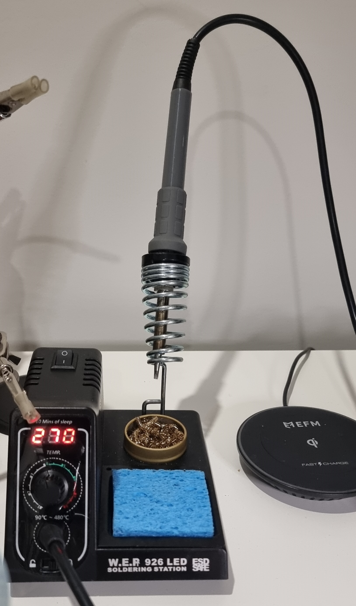
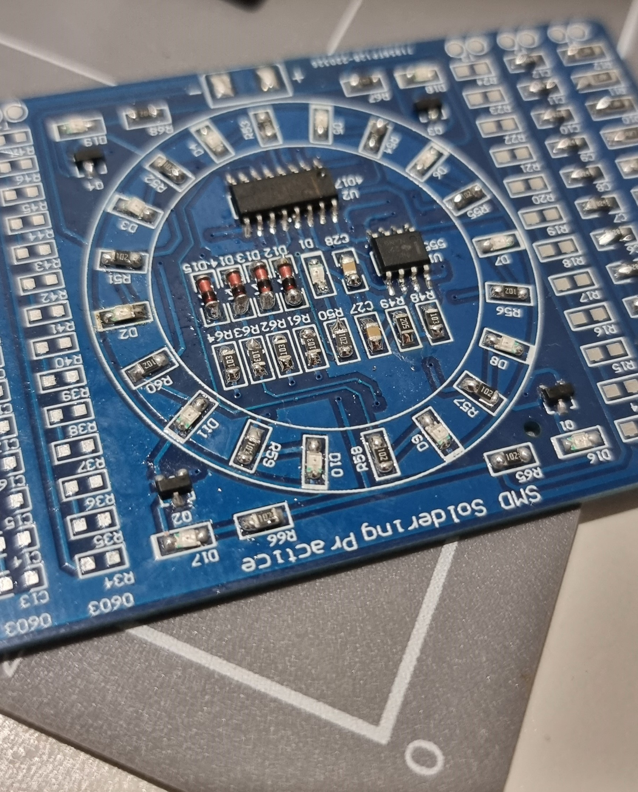

# Aussie building a Corne - Part 1 - Soldering

I couldn't think of a better place to start because if you're undertaking a full diy corne build, you're gonna be doing a lot of it. Before this project I was a very C grade solderer and had done almost no surface mounting so I thought it important to hone my skills before I wreck the most expensive keyboard I've ever had.

## EQUIPMENT

### Soldering iron

An absolute must have is a temperature controlled iron but that doesn't mean expensive. I've got an Ebay cheapy, 60w soldering station. It cost me less than $50AUD delivered and came with multiple tips (also important).

### Solder

I don't think it matters too much. Leaded solder requires a lower temperature (important for certain microcontrollers). Again, not expensive. I got a $5AUD hobby tube of 0.71mm 60/40 solder from Jaycar and still have most of it left.

### Flux

While most solder comes with a flux core, additional flux still a must have for surface mount soldering. I've used a soldering fluid (liquid flux) in the past with decent success on old automotive wiring but I'd heard good things about flux paste. This was probably a little more expensive than I intended ($22AUD for 56g tub from Jaycar) but the whole tub will last me years.

### Tweezers

Make sure to size them appropriately to the components. Usually the smaller the better and reverse action is preferable.

### Helping hands/magnifiers

I don't think are necessary. I have a little magnifying stand but it throws out my depth perception and my iron accuracy is then shot so I don't use any. And I would just solder on my desk with a cutting mat on top.

## PRACTICE

Surface mount soldering practice boards exist and are relatively cheap in comparison to a keyboard. For under $9AUD on Ebay I had a practice board that came with leds, resistors, diodes etc. Changing the tips and adjusting the temps really let's you get your technique down and perfected. While a number of videos had said to hold your iron on the soldering pad and pin, then apply your solder at the junction of the 3, when dealing with tiny diodes and leds, it's not really feasible. So here's a few tips:

1. A smaller chisel tip with a small amount of solder on it was far easier
2. Cleaning the tip with a coiled wire cleaner and wet sponge every few joints helped keep that tip in the best condition for soldering
3. Flux paste on the pad helps flow the solder exactly where it needs to be
4. Be quick. Each joint should only take a couple of seconds. Any longer and you risk damaging the component. If you can't get it, move to the next component and come back after it's cooled down
5. Keep the temperature as low as you can. I heard nicenano's can be damaged with temps above 280C so I practice with 270 without issues

## SUMMARY

So all of this helped me get these sorts of results and I was happy enough to start the corne which will be in the next part.

