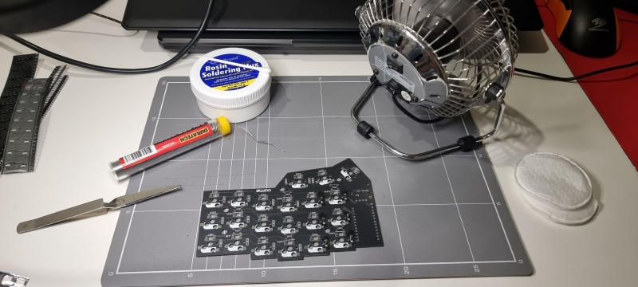

# Aussie building Corne - Part 2 - The kit

Deciding on a new project is always a time consuming process for me as I tend to dive in head first and try to find out as much as I can first. It was a workmate who bought a Dygma Raise that first sparked the interest but I couldn't justify its cost (about $500AUD). I just knew I wanted an ergo split keyboard for a smaller price tag but with as many features as I could cram in. So the youtube rabbit hole began.

With the help of videos from [Joe Scotto](https://youtube.com/@joe_scotto?si=ZiEcp3nnhzfaE4-Q) and [Ben Vallack](https://youtube.com/@BenVallack?si=eHl3Z9LDvi2VY2ko) I came to the conclusion of the Corne. I wanted the challenge of going to a smaller layout from a 100% but wasn't about to give up my 6 columns (learning to deal with layers and columns stagger was going to be a task already).

I might cop some flack for this but I don't like wireless keyboards. With the latency of dying batteries and having to deal with batteries in general, I've always preferred wired. And it had to be usb C; no point using an outdated plug for this new project plus I've already got a number of the cables at home. Also most of the usb c microcontrollers use the rp2040 and tend to have more storage capacity (important for custom oled animations etc).

So the hunt was on. There's a few stores in Aus that sold the kit but initially CustomKBD in Melbourne sparked my interest. They had a Discord and healthy community following, as well as a decent range. I'd decided on the SeaPicro mcu but it was out of stock so I waited. And waited. And asked about etas. And waited. Nothing. I looked around and found another store KEEBD.

KEEBD is based in Sydney and had the Corne with Helios mcu's (same specs as SeaPicro). And they had stock. Ordered and received by express post 2 within 2 days. As I already had keycaps and switches from another mechanical board the order consisted of the v3 kit, the mcu's, female socket headers, and all the leds (underglow and per-key). Total was $168AUD.

Now the real fun begins! 

EDIT: in part 1 I forgot to include the usb desk fan for fume dissipation. I know it's not an extraction fan but it's better than breathing the smoke in directly (and it's pointed at a window).
