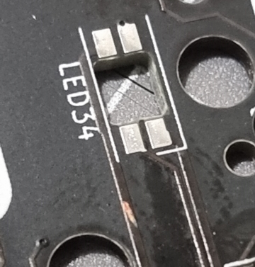
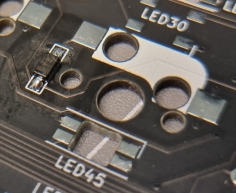
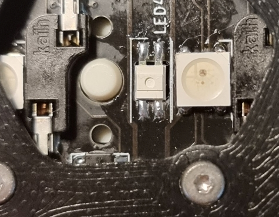
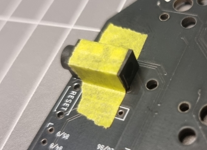
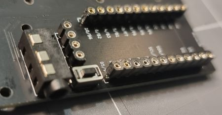
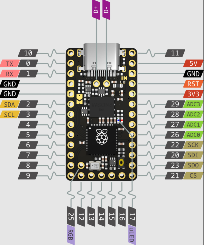
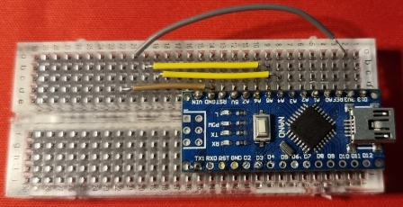

# Aussie Building Corne - Part 3 - Assembly

A key thing to note here is that I paid close attention to the appropriate build guide ([here](https://github.com/foostan/crkbd/blob/main/corne-cherry/doc/v3/buildguide_en.md)).
I would also highly recommend inspecting your pcb's for defects thoroughly before starting your build. I found a scratched trace on mine that didn't hamper performance. I will be masking it off and spraying a protective circut board lacquer over it as an added precaution.

Filing down the pcb separation points was the first step but they could have been left as they were. This kit was already seperated so I didn't need to do what it mentions in the build guide.

Apologies for the poor focus on the image. Please pay attention to the lines on the diode placeholders on the pcb.

## COMPONENTS

Apply flux to all pads before soldering them!

### Diodes

While small, the diodes weren't as small as some of ones that came with the practice board I'd mentioned in Part 1.
The biggest thing to pay attention to is the orientation. The line shown in the image above indicates this and must be lined up with the matching horizontal line on the diode itself.
This can be a little difficult to see so make sure you've got good light and play with the angle of the diode.

There's two ways I'd go about soldering these:

1. Place a small amount of solder on one pad, then align the diode with tweezers and reheat the solder. One thing I found with this method is that depending on how steady your hands are you may end up not laying the diode flat, and need to go back to adjust.
2. Apply a small amount of solder to the iron directly then hold the diode in place with the tweezers and make contact with both the diode and the pad. This does require a bit more precision and correct tip choice to make this efficient and prevent overheating the component. This was by far the easiest method for the leds. It's also very important to clean the tip of the iron regularly if doing this.

### RGB LEDs

This is probably the most difficult component to solder on this board as each has 4 pins. Again, pay close attention to the build guide and your LED orientation. In this specific case the cut corner pin was to be aligned with right-angled line on each led section. Force yourself to double check the orientation as there was a few times that I placed the led wrong because I'd rotated the board to solder the other side of other leds, but luckily I caught myself before soldering them. Another thing to check is the clearance as the hotswap sockets sit rather close to the underglow RGBs so you need make sure there within their boundary square. If you're successfully soldering at 270C you should be able to solder all 4 pins of each led before moving on to the next, but I tended to do columns at a time, then rotate the board to solder the other side. Positioning the larger, underglow leds was the same technique as the diodes, but slightly different for the per-key as they mount upside down into a cutout so all that was really needed after placing was to hold pressure on top with tweezers to make sure they didn't move while soldering the first pin. Again, preferred soldering method was number 2 as mentioned above.

### THROUGH HOLE COMPONENTS

#### TRRS JACK & RESET BUTTON

The TRRS jack (used for split communication), the reset switch, and the headers for both the oled and the microcontrollers are all through hole components. My recommendation is hold the components in place with painters tape or something equivalent while you solder from the other side. As far as soldering goes, touching the iron to the exposed pin and surround pad, then feeding solder into the junction of 3 was the best method.

#### PIN SOCKETS

I had made the decision to socket the microcontroller so I could swap it out later if I wanted to without having to desolder it. I added machined IC socket headers to the order when I placed it with KEEBD, however I didn't order the pins. WARNING: the standard rectangular style pinned headers you get with the mcu's DO NOT fit into these sockets. I had found a [post](https://github.com/joric/nrfmicro/wiki/Sockets) that discussed the different types of socket types and pins, and decided on the budget option, led strip pin headers. I'd sourced these from Ebay and got 100x 5 pin headers for $13.21AUD and they fit directly into the sockets. For those lazy types I wouldn't recommend this as each pin had to be removed from the headers manually (I found heating each one with a soldering iron allowed it to be pushed out quite easily). As I was going to use the OLEDs in my build, you do have to take something else into consideration. You can't use the same height headers for both the OLEDs and the mcu as the old needs to sit above the mcu when installed. Something I will do in the future is consider my other socket options to have the mcu sit lower again and possibly even use some that are joined in the middle for easier placement and alignment. One thing to look out for here though is the clearance required for any components on the mcu (usb port, buttons etc) or if you were going wireless, clearance for the battery.

### MICROCONTROLLERS & OLEDS

#### MCUs - Helios

Once the sockets were installed I pushed the pins into each socket and placed the mcu on top. Same soldering procedure as the other through hole stuff. To combat the height difference required between the mcu and oled I decided not to include the plastic pin holders on the mcus, but retained them for the oleds. Because the pins I'd used for the sockets are approx 10mm long, I trimmed the excess off. Orientation plays a big role here too as you need to make sure that your microcontroller pins are lined up properly with the pinout on the board. For most pro-micro based mcus that means the board must be mounted upside down. While the pins on the Helios weren't labelled, the ground pins had square pads and the others had round, and with two ground pins next to each other on side, and one on the other, the orientation required was quite clear.

#### OLEDs

This section comes with a big warning! Please double check with your supplier whether the oleds provided have pre-soldered pins or not. In my case they did, and weren't gonna work with the sockets that I had used so I had to do some desoldering that I hadn't planned on. It was late at night and I wanted to get this project done so I rushed it and damaged one of the oleds. I don't have the appropriate equipment for desoldering (just some wick) but it's now prompted me to get a desoldering pump at a minimum. I'd managed to completely remove a pad from one of the oled pins but managed to find it in the solder blob and put it back onto the pin. Again, placing the pins into the sockets I then re-pinned the oleds. I wasn't overly confident in my ability when I did so, and didn't want to connect the oled to the keyboard for fear of damaging another component. Thankfully I had an old Arduino Nano and a breadboard that I could throw together a quick circuit and flash a little example to to check the oleds still worked, which they did. PHEW!

### HOT-SWAP SOCKETS

These are as easy to solder as the through hole stuff. With flux and some solder on the iron, hold the socket in place and touch the iron to the junction of the pad and the socket pin. Watching that solder pull into where it's supposed to be is so satisfying!

### SUMMARY

And that is all the soldering done!
