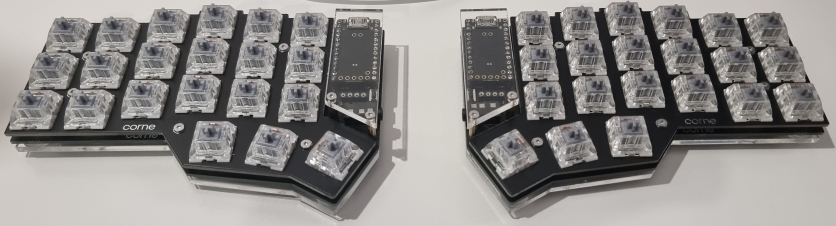

# Aussie Building Corne - Part 4 - Case & Testing

## Case

The Corne V3 kit did come with a basic, sandwich case (acrylic base, FR4 mid plate, brass standoffs and rd bumpers for feet) which would be fine for the first few days but I really wanted to get a 3D printed case with tenting options.

I was fairly confident in my soldering work and went straight ahead into assembling the case. I would not suggest doing this for a reason I mention later. I would first get QMK setup and flash a default keymap.

