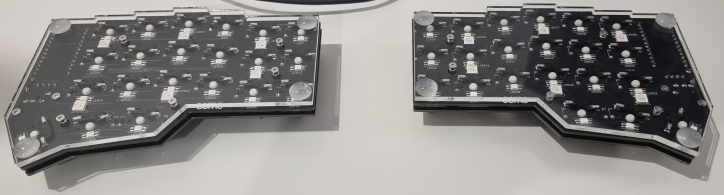
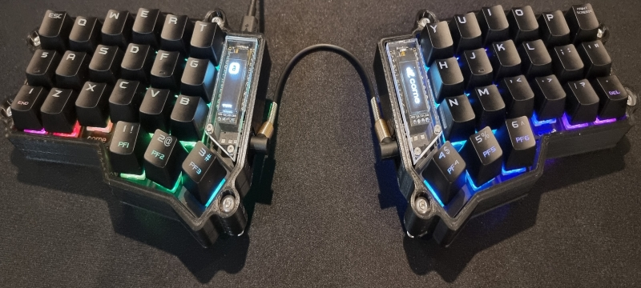

# Aussie Building Corne - Part 4 - Case, Firmware & Testing

Note: this part of the guide is only based on the research that I had done and my own experience. If I state something that is incorrect I am happy to be corrected and will add edits accordingly. It is also only looking at a QWERTY layout.

```
WARNING: Pay close attention to what you are doing when unplugging and replugging the keyboard. Any split keyboard that uses a TRRS jacks to trasmit data between the two halves can have the microcontrollers damaged if the USB cable is not disconnected before removing the TRS cable. This is to do with the contacts inside the reciever. I've experienced this first hand!
```

## Case

The Corne V3 kit did come with a basic, sandwich case (acrylic base, FR4 mid plate, brass standoffs and rd bumpers for feet) which would be fine for the first few days but I really wanted to get a 3D printed case with tenting options.

I was fairly confident in my soldering work and went straight ahead into assembling the case. I would not suggest doing this for a reason I mention later. I would first get QMK setup and flash a default keymap.




Earlier when I was doing my research about the Corne I had come across a video by EIGA ([here](https://www.youtube.com/watch?v=YlZPnh9cbQU)) that showed what I thought was a very aestheticly pleasing and practical design for such a case so I started the hunt for an STL. Eventually I found it [here](https://www.printables.com/model/347524-corne-keyboard-case-5-and-6-columns) and found a local guy that I entrusted with the printing, in black PLA with 100% infill. A big thanks to [Too Easy 3D](tooeasy3d.wordpress.com) for doing this for me as I couldn't have asked for a better result. In fact, at the moment he's tweaking the model for me to improve the access to the connections and buttons via the cutouts.

Something that I particularly enjoyed about this particular case was the flexible and cheap tenting options. By utilising different length M5 bolts and nuts captured by the case, you are able to adjust the tenting to exactly what you wanted. I thought what better material to compliment the silver standoff screws and silver solder joints than stainless steel. So I went to my local fastener shop and purchased 4 or 5 different length stainless steel button head bolts (4 of each) and 8x nuts. I decided against using nylocs as suggested because I wanted to be able to remove them by hand to adjust. For the bottom of the bolts, I just found some silicon/rubber end caps that were appropriately sized to minimize the halves from sliding across the desk. And this is the end result:



## Firmware

### First Firmware

Now, this is a point that I mentioned earlier that I would expand on. I can highly recommend that you go through the setup process of QMK and use a prebuilt firmware for your keyboard so you can test everything before spending the time customizing it to the way you want it. In my case, I spent hours creating my first custom keymap and firmware only to find out once I'd flashed it that one of the per-key RGB leds had a dead green diode and needed to be swapped out. I would use the [QMK Documention](https://docs.qmk.fm/#/) as your # resource for setup and reference throughout your new keyboard journey. As I was on Windows and due to the RP2040 based MCU wasn't able to use QMK Toolbox to flash my firmware (not to my knowledge anyway) I had to install [QMK MSYS](https://msys.qmk.fm/) and then forked QMK into my own repo on GitHub.

### QMK Configurator

I found QMK Configurator to be a very good distraction for me while I was waiting for my keyboard kit to arrive as it meant that I could have a think about the key layout and layers that I wanted to use, and, I know for me at least, when I have a new project underway it's the only thing I can think about. Before I get into the details of my keymap I will mention this important part: if you use an RP2040 based MCU, the firmware file downloaded from the Configurator will not be able to flashed to your MCU as it is, and in my research I didn't come across a way to convert it once it was already compiled. You can download the keymap.json file but that's also not in a format that can be used directly with your custom firmware.

### My Keymap

#### Alphanumerics and Space

While I have made some slight adjustments since I created the first keymap, it's still 90% original from when I first created it. Going from a 100% keyboard down to the Corne was already going to be a big step so I wanted to try to make that transition as smooth as I could (hence the 42 key layout as opposed to 36). A couple of things that I'd noted from my daily keyboard use was that I used both thumbs to press spacebar and that I'd more commonly use the numberpad over the number row for my numbers. That meant I needed a numberpad on my right half of the split (on it's own layer), and that I possibly needed two spacebar keys. The default keymap for a Corne has the spacebar on the left split thumb cluster so I took it upon myself to take some typing tests on a standard keyboard and force myself to only use my left thumb. What I thought was such a minimal thing turned out to be quite a big deal as I went from a typing speed of approx 100 wpm, down to 44wpm. I took the same test again but only used my right thumb and achieved 90 wpm. Decision made!

#### Modifiers

Originally I was going to use the outer columns on both sides for Shift and Ctrl, again, to help make the transition easier. However, in my research I came across Home Row Mods and how much of an impact they can have on ergonomics if you can wrap your head around them. For those that don't know HRM basically shifts your modifier keys (Shift, Control, Alt, OS) to the home row (F, D, S, A - J, K, L, ;). A key feature of QMK that allows this is called [Mod-Tap](https://docs.qmk.fm/#/mod_tap), which allows a key to be tapped to type one key, but then provide a different function when held. Ultimately this moves the modifiers away from your pinky fingers and to the row where your fingers are the strongest and always come back to, minimizing movement.

#### Layers

When I first started out I considered having 3 layers: 1. Alpha, 2. Numbers and Navigation (arrows, page up, page down, home, end), 3. Media. But after a brief test of using the arrows on my left hand while holding the layer toggle with my left thumb, I found it to be too uncomfortable. Plus I then couldn't have my modifiers to access the symbols that were on the shifted numberpad. So now I have 5 layers: 1. Alpha (default), 2. Numbers/Symbols (left thumb toggled), 3. Navigation (right thumb toggled), 4. Media (left pinky toggled, 5. Brackets (right pinky toggled - home row parenthesis used for coding)). But I'm sure this layout may change in future. Note: I find pinky toggled layers more comfortable than using the inner-most thumb cluster keys.

#### Later Additions

A couple of notable additions that came later in the piece include:

<ul>
    <li>the addition of a left handed backspace and delete (on Number/Symbol layer) so I can use the mouse in my right hand and still be able to edit without having to go back and forth to the mouse</li>
    <li>RGB controls on the media layer for brightness, colour etc</li>
    <li>Caps Lock combo - pressing both HRM Shifts at the same time</li>
    <li>Print Screen Key Override - HRM LCtrl + Backspace is PrtScn
</ul>

### Firmware

#### Compilation

I'll reiterate that the steps required here could be different if you're not using a RP2040 based MCU. But the easiest way to start your own custom firmware would be to copy an exiting folder found in the keymaps folder of your keyboards directory (in my case qmk_firmware/keyboards/crkbd/rev1), rename the folder, and edit the files. Google is your biggest friend here and I found the most useful resources to be the [QMK Documentation](https://docs.qmk.fm/#/), [r/ErgoMechKeyboards](https://www.reddit.com/r/ErgoMechKeyboards/), [r/olkb](https://www.reddit.com/r/olkb/) and the [QMK Discord](https://discord.gg/Uq7gcHh).

Getting back to the QMK Configurator keymap.json file mentioned earlier, if you copy it into your custom folder and open the QMK CLI (QMK MYSYS), 'cd' into the custom folder. Once you've done that you can enter the following:

```
qmk json2c > filename.c
```

What this will let you do is grab the keymaps in the correct layout to put in your modified keymap.c file. A basic source code of a qmk keymap includes:

<ul>
    <li>keymap.c (where your keymap, rgb, oled setups live)</li>
    <li>config.h (configuring items for the features in rules.mk)</li>
    <li>rules.mk (enabling/disabling features mostly)</li>
</ul>
More advanced keymaps can import other files etc so depending on which type you copy from, your structure could look slightly different but still have these staples.

Once you're ready to compile the firmware (again for my case specifically), I did the following:

<ol>
    <li>Opened the QMK CLI</li>
    <li>Ensured it was pointing at qmk_firmware using 'cd qmk_firmware' (during setup I imagine you can specify this but I didn't)</li>
    <li>Typed the following:</li>
</ol>

```
qmk compile -kb crkbd/rev1 -km custom -e CONVERT_TO=helios
```

What's important to note here is that '-kb xxxxxx' defines the location of the keyboard version within the keyboards folder of qmk_firmware, '-km custom' is the name of the folder inside the keymaps folder where your custom files are located, and the 'CONVERT_TO=helios' performs the conversion that I needed to be able to flash my Helios MCUs. For a list of other supported conversions please go [here](https://docs.qmk.fm/#/feature_converters?id=overview). I imagine that as long as your MCU has the same features, pin layout and controlling chip as one with a supported convertor, you could use it but please do your own research first.

#### Flashing

The version of the Corne that I used came with a reset button which you can use to put the MCU into bootloader mode by:

<ol>
    <li>Ensuring the USB is unplugged first, then disconnecting both halves</li>
    <li>Hold the reset button down and plug the USB cable in</li>
    <li>Release the reset button</li>
</ol>
On the Helios MCU (or most RP2040 based MCUs) this should cause the MCU to show up as a USB storage device where the firmware file can be copied to (after the above compilation steps you'll find the .uf2 file in the qmk_firmware directory). This process needs to be done seperately for each half of the keyboard before they can be connected.

A slightly alternate way of doing this would be to use the following command instead of the compilation one above:

```
qmk flash -kb crkbd/rev1 -km custom -e CONVERT_TO=helios
```

The one difference here is that after it's compiled, the QMK CLI will look for an MCU in bootloader mode and copy it across automatically, but only to the first half. You still need to perform the manual copy and paste for the second half.

## Testing

After all of that I plugged in the keyboard and everything worked (except for the RGB led mentioned earlier) and I can tell you that it was a relief!
